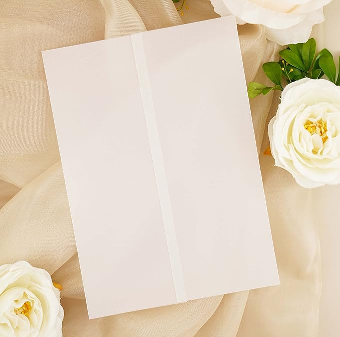
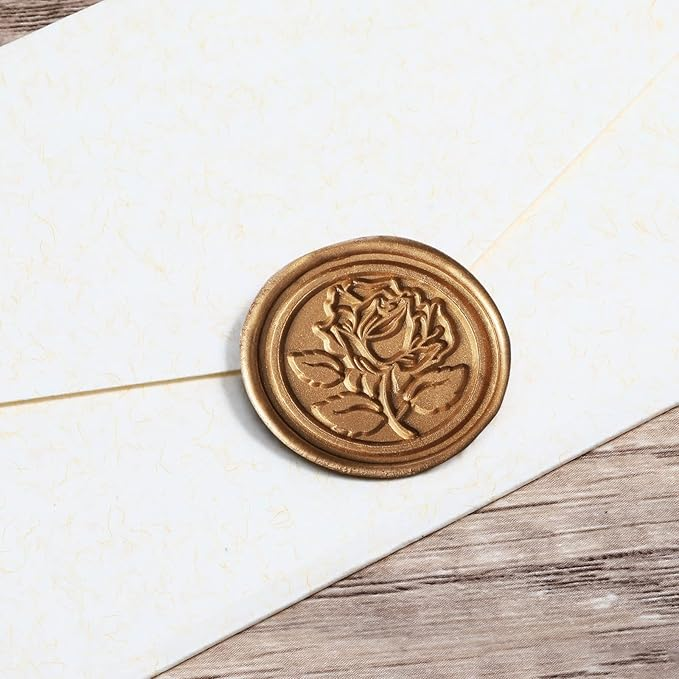
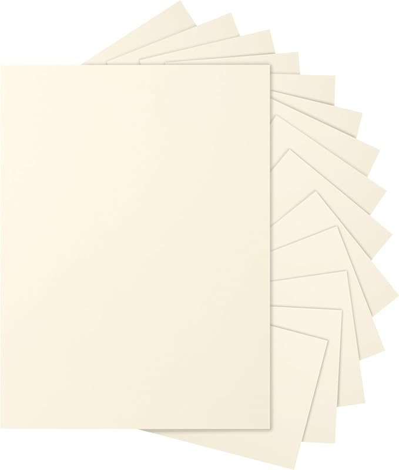
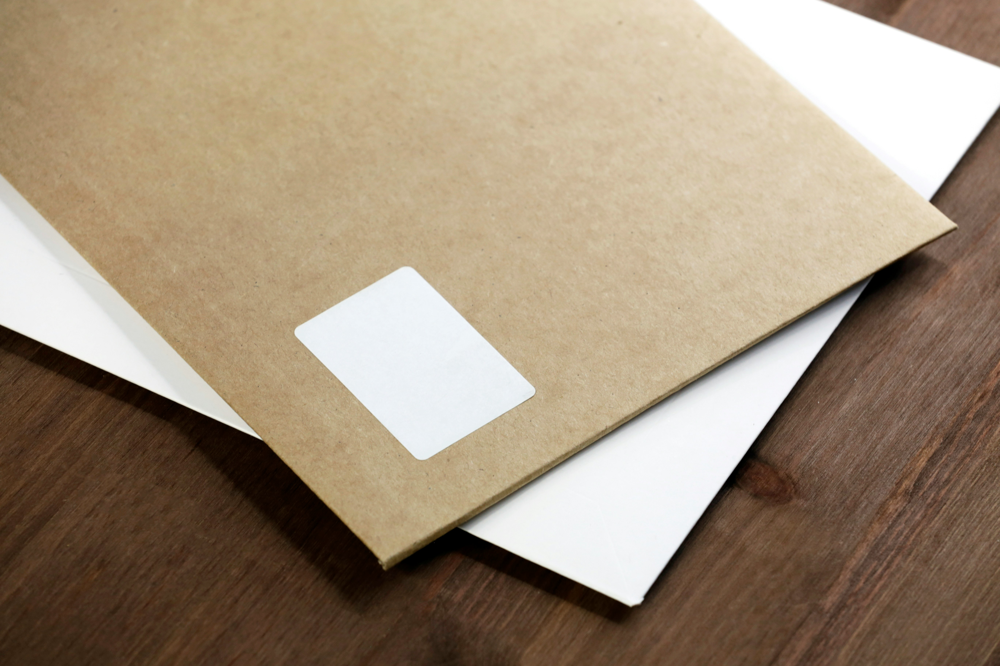

# Crafting the Perfect Wedding Invitations: A Guide to Elegance and Timing

Your wedding invitation is more than just a piece of paper – it's the first glimpse your guests will have into your special day. It sets the tone, builds excitement, and provides crucial information. Let's dive into four essential elements that can elevate your invitations from ordinary to extraordinary, and discuss the perfect timing for sending them out.

## 1. Vellum Jackets: A Touch of Ethereal Beauty

Vellum jackets add a layer of sophistication and dreamy elegance to your invitations. This translucent paper creates a beautiful layered effect when placed over your main invitation card.

How to use:
- Choose a vellum weight that complements your card stock (typically 30-40 lb)
- Print delicate designs or your names on the vellum for an extra special touch
- Use vellum as an overlay for your entire invitation suite or just the main card
- Secure it with a wax seal, ribbon, or decorative brad for a polished look

Pro tip: Vellum is perfect for outdoor or garden weddings, as it evokes a light, airy feel.

[View Vellum Jackets on Amazon](https://amzn.to/3XCFw3p)

## 2. Wax Seals: A Stamp of Timeless Romance

Nothing says classic romance quite like a wax seal. This age-old tradition adds a tactile, luxurious element to your invitations that guests will love.

How to use:
- Choose a seal design that reflects your wedding theme or personal style
- Use colored wax that complements your invitation palette
- Apply seals to close vellum jackets, secure ribbon closures, or as decorative elements
- Consider custom monogram seals for a personalized touch

Pro tip: For destination weddings, incorporate a seal design that represents your location.

[View Wax Seals on Amazon](https://amzn.to/3ASjH7X)

## 3. Premium Card Stock: The Foundation of Luxury

The quality of your card stock can make or break your invitation. Opt for thick, textured paper that feels substantial and luxurious.

How to use:
- Choose a weight between 120-140 lb for invitations
- Consider textured options like linen, cotton, or felt for added elegance
- Select a color that complements your wedding palette
- Use the same stock for your entire suite for a cohesive look

Pro tip: For formal weddings, stick to classic whites and creams. For more casual affairs, don't be afraid to experiment with colors.

[View Card stock on Amazon](https://amzn.to/3AWZqyj)

## 4. Elegant Address Labels: Making a Stellar First Impression

Your envelope is the first thing guests will see, so make it count with beautiful address labels.

How to use:
- Design labels that match or complement your invitation style
- Use high-quality adhesive labels or opt for printed envelopes
- Consider hiring a calligrapher for a truly luxurious touch
- Don't forget return address labels for a polished look

Pro tip: If using dark envelopes, opt for metallic or white ink for maximum impact.

[View Labels on Amazon](https://amzn.to/3zbnEUU)

## Timing Is Everything: When to Send Your Invitations

The timing of your invitation mailing is crucial. Here's a general guideline:

- Save-the-Dates: 6-8 months before the wedding
- Standard Invitations: 6-8 weeks before the wedding
- Destination Weddings: 3-4 months before the wedding

Remember to set your RSVP deadline for 2-3 weeks before your wedding date. This gives you time to follow up with non-respondents and provide final numbers to your vendors.

## Pulling It All Together

When combining these elements, consider your wedding style and budget. For a cohesive look, choose one or two standout features (like a wax seal on vellum) and keep the rest simple. Remember, your invitation is a reflection of your event, so let your personality shine through.

By carefully selecting your materials, paying attention to details, and timing your mailing just right, you'll create wedding invitations that not only inform but also delight your guests. These beautiful invitations will build anticipation for your big day and become cherished keepsakes for years to come.